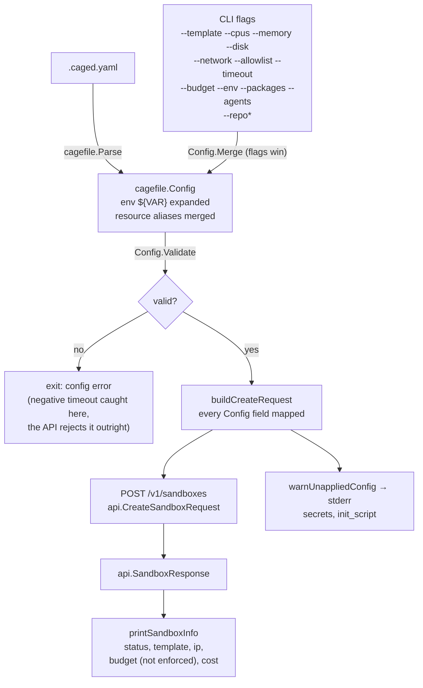

# Flow: `.caged.yaml` to a created sandbox

Every key the CLI parses has to end up on the wire. A key parsed into
`cagefile.Config` and absent from `api.CreateSandboxRequest` is a setting the
user wrote, the CLI accepted, and nobody applied — which is what happened to
`timeout`, `secrets` and `init_script`.

## Field map

| `.caged.yaml` | request JSON | server behaviour |
|---|---|---|
| `template` | `template` | validated, aliases resolved |
| `resources.cpu` / `.memory` / `.disk` | `cpus` / `memory_mb` / `disk_gb` | bounded per plan |
| `network_mode`, `allowed_hosts` | `network_mode`, `allowlist` | allowlist required when mode is `allowlist` |
| `env` | `env` | merged with any Environment the Persona/Harness carries |
| `packages`, `agents` | `packages`, `agents` | installed at boot |
| `repo.*` | `repo`, `repo_token`, `repo_branch`, `repo_commit`, `repo_subdir` | cloned at boot; `repo.token_env` is read locally, never sent as a name |
| `timeout` | `timeout` | idle timeout, clamped to the plan maximum, negative rejected |
| `budget` | `budget` | recorded only — no enforcement anywhere in the platform |
| `secrets` | `secrets` | decoded by the API, not applied by any current path |
| `init_script` | `init_script` | decoded by the API, not applied by any current path |

## Response fields

`api.Sandbox` declares only fields the API populates. `cost` is always sent,
including zero, so `$0.00` is a real figure. `init_script`, `timeout` and
`config` appear in the API's response type but no server path fills them in,
so the client does not decode them — a permanently-zero field is
indistinguishable from data, which is how a `spent` field that no API has
ever sent reported `$0.00` spend for every sandbox.
